# Windows 配置说明

## 重要说明

- 本软件仅适用于 x64 架构。也即，本软件无法在 32 位（x86）操作系统上运行。本软件理论上也无法在 aarch64/arm64 架构下运行。
- 启动图形界面需要 WebView 2 运行时。当 WebView 2 不可用时，程序会退化到[命令行界面](./cli)。因此：
  - 如果你使用 Windows 11 操作系统，则 WebView 2 已经预装在系统中，你不需要做任何其它操作。
  - 如果你使用 Windows 10 21H1 或更新版本，则 WebView 2 将自动安装。如果你手动卸载了它，建议你前往前往[此处](https://go.microsoft.com/fwlink/p/?LinkId=2124703)重新获取。
  - 如果你使用其它版本的 Windows，建议你前往[此处](https://go.microsoft.com/fwlink/p/?LinkId=2124703)获取 WebView 2。
- 本软件未在低于 Windows 10 的系统下测试，不保证其能正常工作。

## 第一步：下载 VS Code

前往[官方网站](https://code.visualstudio.com/)获取 Windows 版 VS Code 并安装。

## 第二步：获取本软件

直接在[网站首页](https://vscch.guyutongxue.site/)下载即可。Windows 版共有两种下载：

- （默认）可执行文件（.exe）。该版本体积小，且操作方便；但可能需要你手动安装 WebView 2。
- 安装器（.msi）。该版本下载后需要首先运行安装器（此时会自动安装 WebView 2 等相关依赖库）才可运行。如果你希望长期使用本软件，你可以下载安装器安装。

## 第三步：开始配置

双击运行本软件。若 WebView 2 正确安装，则将弹出图形界面；此时点击下一步以继续。

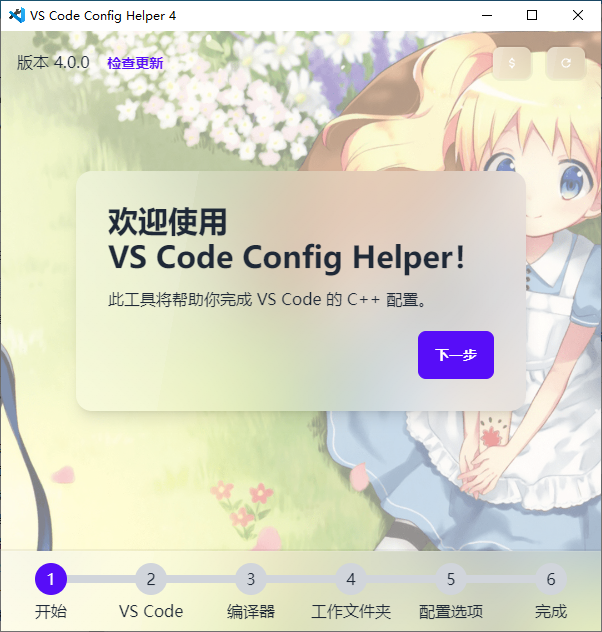

如未弹出图形界面（如下图），意味着图形界面无法启动。请按照[上文说明](#重要说明)安装 WebView 2，或者移步[命令行界面](./cli)操作说明。

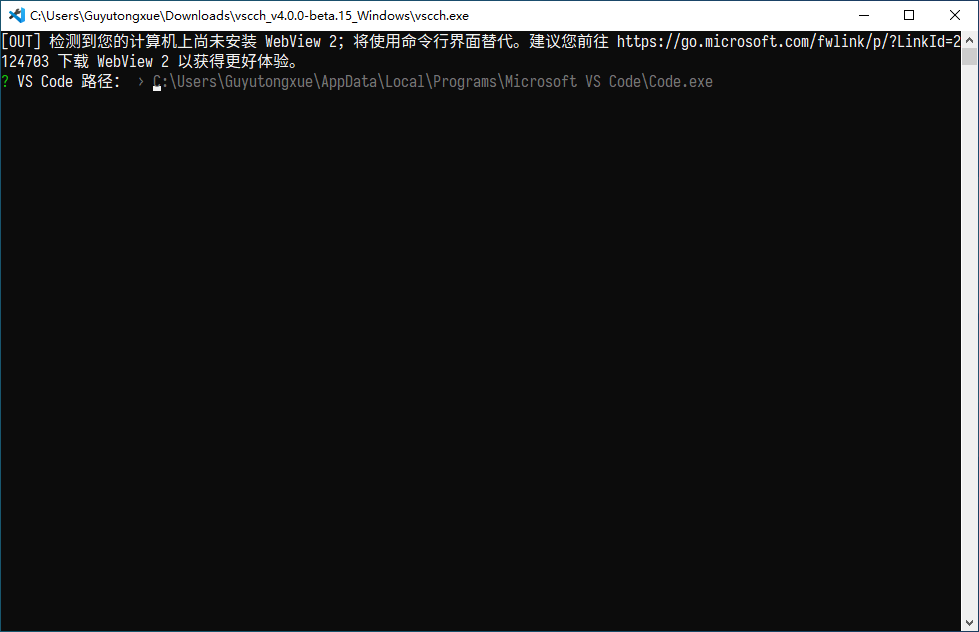

### VS Code 选择

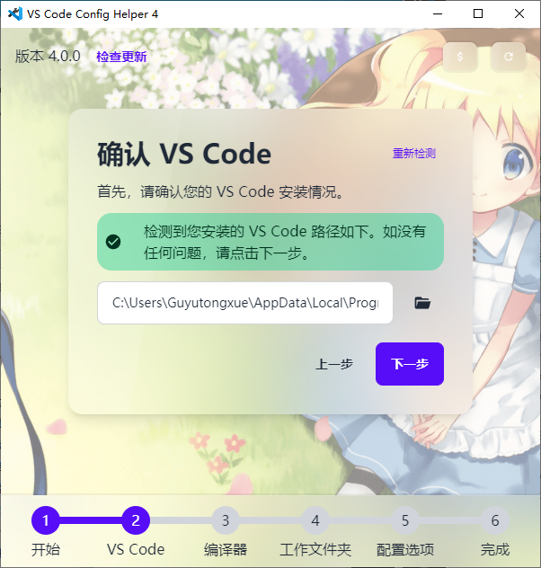

如果你已经正确安装了 VS Code，则此处将显示你的 VS Code 安装路径，点击“下一步”即可。如果你不能点击下一步，则表明工具没有检测到已安装的 VS Code。这可能是由于你正在使用“绿色版”或“免安装版”的 VS Code。此时你需要在这里手动输入其路径，或者重新从官网安装。

### 编译器选择

在 Windows 上，你至少有三种类型的编译器可供使用：

1. 基于 GCC 工具链的 [MinGW-w64](https://mingw-w64.org)；
2. Microsoft Visual C++ 构建工具；
3. 基于 [LLVM 工具链的 MinGW](https://github.com/mstorsjo/llvm-mingw)。

一般使用第 1 种——即 MinGW-w64 编译器就足够使用了。但如果你已经安装过 Visual Studio，则我更建议你使用第 2 种——即 Visual C++ 编译器。

点击下方的选项卡以分别显示每种编译器的操作流程。
 

  <a class="tab tab-active" data-target="tabMingw">MinGW-w64</a> 
  <a class="tab" data-target="tabMsvc">Visual C++</a> 
  <a class="tab" data-target="tabLlvm">LLVM MinGW</a>

默认情形下，工具会尝试检测已有的 MinGW 安装。如果你之前使用过 MinGW（并将它添加到了 `Path` 环境变量），则这里将列出它们。选择你希望使用的 MinGW，点击下一步以继续。

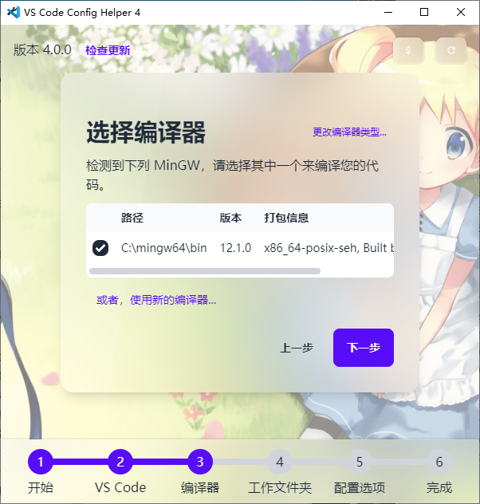

如果你之前未使用过 MinGW，你将看到下面的界面：

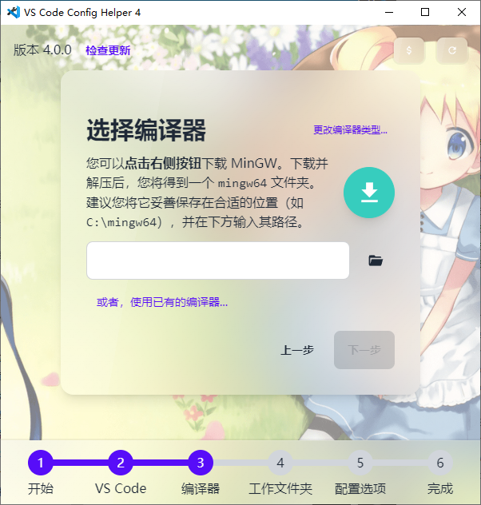

此时，点击右侧圆形按钮以下载 MinGW。你将打开蓝奏云网盘，按照提示下载压缩包。将下载得到的压缩包解压后，妥善保存在磁盘上的某个位置，**不要删除**。随后，将这个位置的路径输入到下方的文本框。如果输入正确，工具将检测到该 MinGW，点击下一步继续即可。

点击右上角的“更改编译器类型”，选择“VC++ 生成工具”。

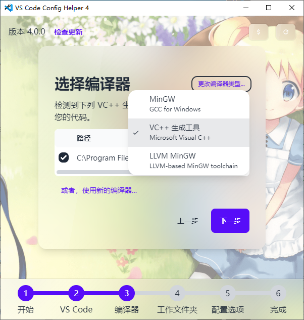

如果你已经安装过 Visual Studio（2017 及更新版本）或 Visual C++ 生成工具，工具将检测到它们并列举出来。选择你要使用的版本，点击下一步继续即可。

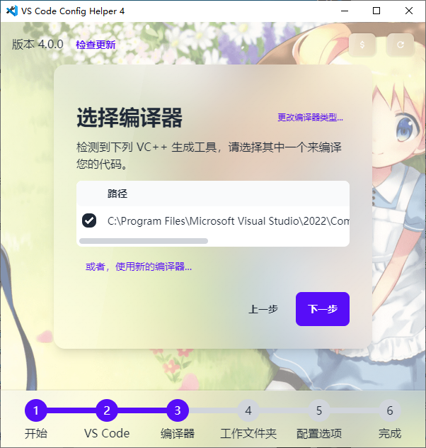

如果你尚未安装过 Visual Studio 或 VC++ 生成工具，你将看到如下界面：

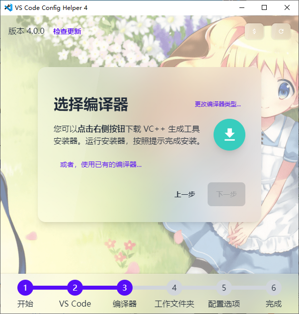

此时，点击右侧圆形按钮将引导你下载 Visual C++ 生成工具 2022 的下载器。按照下载器指示操作。操作完成后，点击下方的“重新检测”按钮。

点击右上角的“更改编译器类型”，选择“LLVM MinGW”。

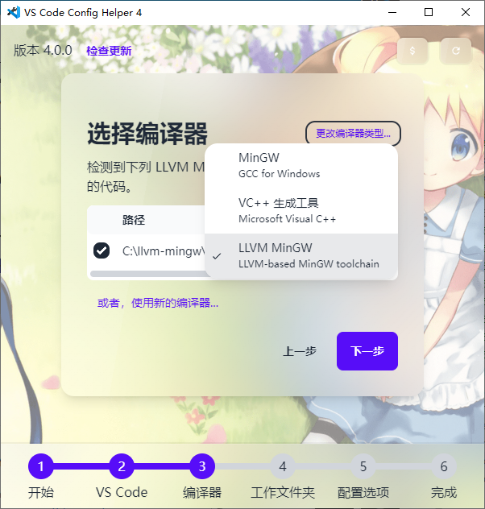

工具会尝试检测已有的 LLVM-MinGW 安装。如果你之前使用过（并将它添加到了 `Path` 环境变量），则这里将列出它们。选择你希望使用的 LLVM-MinGW，点击下一步以继续。

如果你之前未使用过 LLVM-MinGW，你将看到下面的界面：

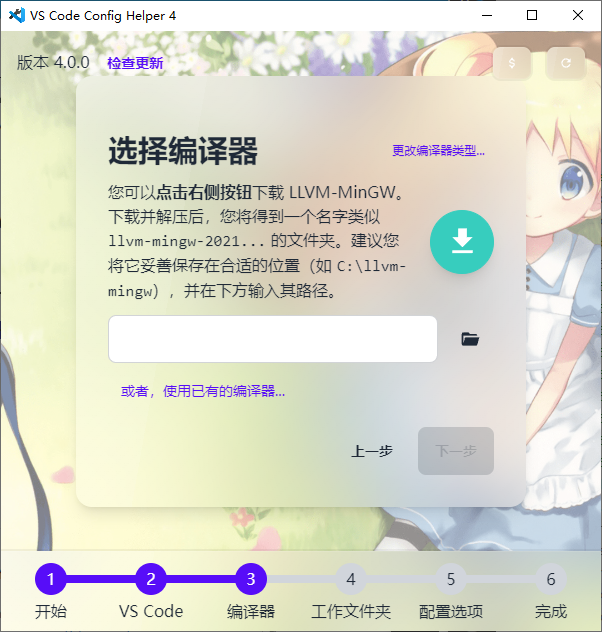

此时，点击右侧圆形按钮以下载 LLVM-MinGW。浏览器将打开并下载最新版的 LLVM-MinGW。将下载得到的压缩包解压后，妥善保存在磁盘上的某个位置，**不要删除**。随后，将这个位置的路径输入到下方的文本框。如果输入正确，工具将检测到它，点击下一步继续即可。

### 工作文件夹选择

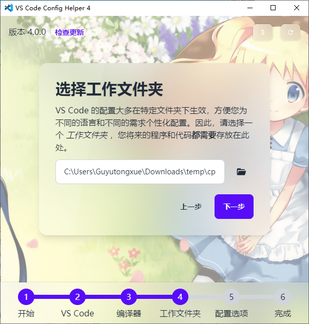

输入工作文件夹路径，你的代码以后应当存放在该文件夹内。若该文件夹尚未创建，则工具会自动创建它。若你使用 MinGW，则**工作文件夹及其中的文件不能包含中文或特殊字符**，否则将无法调试代码。

点击“下一步”以继续。

### 调整配置选项

一般保持默认即可，具体可参考[配置选项说明](./options.md)。点击“下一步”后，耐心等待工具完成配置流程。

## 第四步：测试

如果配置选项中勾选了“配置完成后自动启动 VS Code”，且未禁用“生成测试文件”，则工具将自动为你打开工作文件夹，并显示工具生成的测试代码。

如果你第一次使用 LLVM-MinGW，CodeLLDB 扩展会启动并下载必要组件。请耐心等待其完成。如无法下载，可尝试切换网络环境。

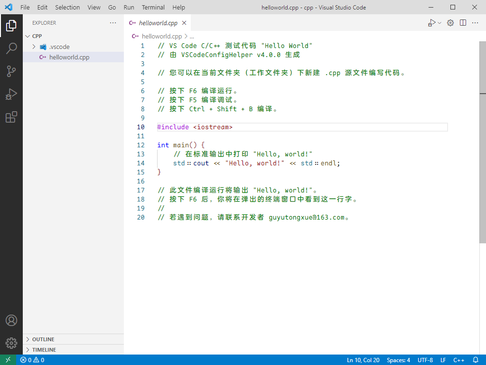

在该页面按下运行快捷键（默认为 <kbd>F6</kbd>），即可编译并运行该代码。

在该页面按下调试快捷键（默认为 <kbd>F5</kbd>），即可调试该代码。调试前建议打断点。

